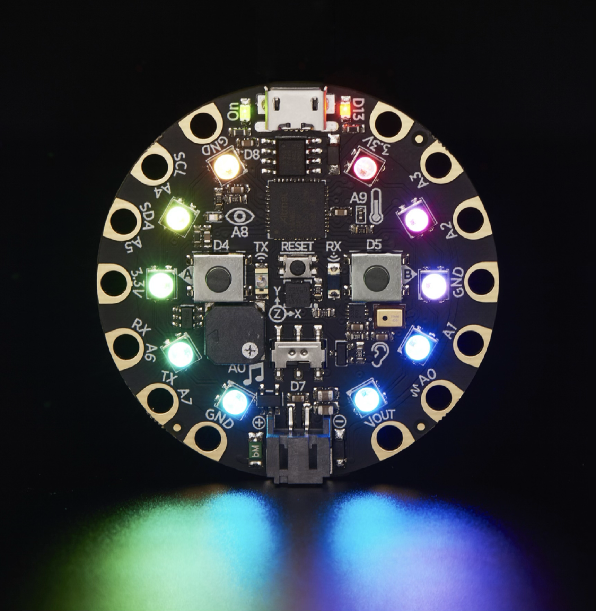

# Circuit Playground
## Class for Spark Makerspace
## Kent Quirk, Feb-Mar 2025

---

# Rough Agenda
(subject to intervention of reality)

*Week* | *Content*
-----|--------
1 | General intro; the Circuit Playground device; demo; getting set up; the mu editor; "Hello, Blinker"; Python 101; a smarter blinker; reference material
2 | Exploring the device (what can it do by itself?); how to use the libraries and documentation; coding tips & tricks
3 | Connecting to other things -- switches, LEDs, motors, servos; hardware info as appropriate; pick personal projects
4 | Project week -- let's make progress on your idea

---

# Links

* [Repository with presentations and example code](https://github.com/kentquirk/circuit_class_25)
* [Circuit Playground Express Quickstart](https://learn.adafruit.com/adafruit-circuit-playground-express/circuitpython-quickstart) at Adafruit
* [CircuitPython download](https://circuitpython.org/board/circuitplayground_express/) for Circuit Playground Express
* [A bunch of example programs](https://docs.circuitpython.org/projects/circuitplayground/en/latest/examples.html) from the API
* [The API reference](https://docs.circuitpython.org/projects/circuitplayground/en/latest/api.html) for the base library
* The [Circuit Playground Express page](https://www.adafruit.com/product/3333) on Adafruit

---

# Circuit Playground Express
## Connection pads

* 8 I/O pads (A0-A7)
* Alligator clips or bolts or solder or conductive thread
* Can be touch pads or PWM outputs (for driving servos) or analog inputs (for reading signals)
* Plus pads for power and ground

---

# Circuit Playground Express
## Sound & Light

* MEMS microphone
* Mini Speaker (class D amplifier)
* Visible light phototransistor for analog light level
* IR Receiver (phototransistor) and transmitter (IR LED)

---

# Circuit Playground Express
## Touch and Motion

* 1 2-position slide switch
* 2 pushbuttons (A and B)
* 3-axis accelerometer
* Touchpad
* Infrared can be a proximity sensor
* (Reset is not programmable)

---

# Circuit Playground Express
## Other

* I2C connection for interacting with a wide range of I2C components -- sensors, controllers, memory, etc.
* Serial interface (UART)
* Temperature Sensor
* 2 MB of Flash
* Runs at 48 MHz
* USB port can act like serial port, keyboard, mouse, joystick, or MIDI
* There is [a version available with Bluetooth](https://www.adafruit.com/product/4333)

---

# Programming it

* This class is going to use Circuit Python
* But it also works with Arduino

---

# Demo
## Just messing around

* Lighting up LEDs in a sequence
* Touch pads control the color
* Switch controls the direction
* Speed control with buttons
* Both buttons turn LEDs off

---

# Python

* Python has existed since the 90s
* It's not like most other languages - whitespace is significant!
* Context depends on indentation (after a colon ':')
* Don't mix tabs and spaces
* No explicit memory management
* Works well out of the box -- "batteries included"
* Circuit Python is Python 3.4...ish. (plus some later stuff)

---

# Sample Python

---

# Data Types

* Ints and floats are different, when you care use `int(x)` or * `float(x)`
* `_` is ignored in constants, `0x`, `0b`, `0o` prefixes supported
* bools are `True` and `False` (caps required)
* Many ways to write strings: `'`, `"`, `'''`, `"""`
* Lists: `[1, 2, 3, 4]` -- can mix types, append, delete, sort, etc.
* Tuples: `(1, 2, 3)` -- immutable (efficient)
* Dictionaries (maps): `x={"a":1, "b":2}` -- retrieve with `x["a"]`. No dot notation.
* You don't declare types or variables -- just use them

---

# Functions and Classes

* Functions: `def myfunc(a, b, c):`
  * Can specify default values (also makes things optional): `def add (v=1)`
* Supports defining classes with member vars and methods
* Some things that are automatic in other languages are weirdly explicit in Python (self, operator overrides, global)

---

# Keywords and Operators

* `if`, `elif`, `else`; `while`; `for x in range`; `for item in list`
* No parens needed
* Always use a `:` after
* exceptions if you must (`try`/`except`)
* Math: `+`, `-`, `*`, `/`, `%` -- integer divide is `//`
* Logical (bool) operations: `and`, `or`, `not` (words)
* Bitwise operations: `&`, `|`, `^`, `~`
* Comparison: `==`, `!=`, `<`, `>`, `<=`, `>=`
* String concatenation: `+`

---

# System Libraries
## "Batteries Included"

* For basic tasks, there's probably already a library
* Use `import` statement
    * `import time`
        * imports as a namespace
        * then use `time.sleep(1)`
    * `from time import sleep`
        * imports just that name into global namespace
        * use as `sleep(1)`
    * `from adafruit_circuitplayground import cp`
        * just to save a lot of typing!

