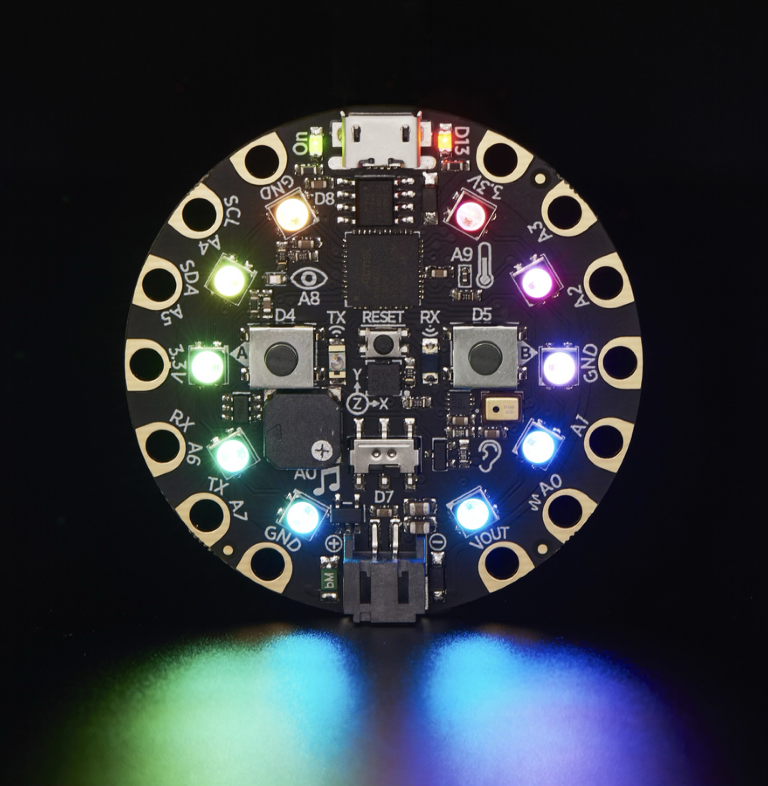
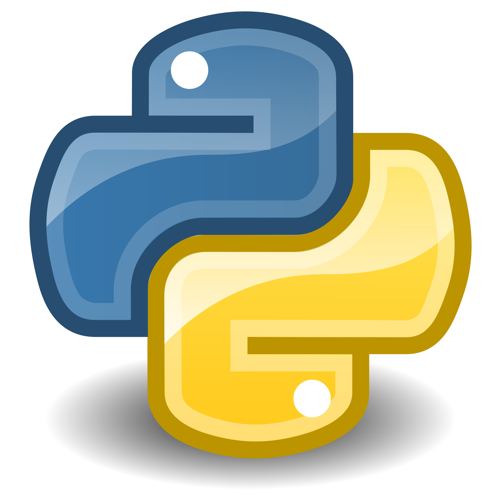

# Circuit Playground
## Class for Spark Makerspace
## Kent Quirk, Feb-Mar 2025

---



# Python
## (with a bit more structure)

* It's a "scripting language"
* Has a virtual machine
* Unusual code structure
* Very fast and easy to write

---

# Sample Python

```py
# simple LED counter for Circuit Playground Express
import time
from adafruit_circuitplayground import cp

while True:
    cp.red_led = True
    time.sleep(0.5)
    cp.red_led = False
    time.sleep(0.5)
```

---

# Import

* For basic tasks, there's probably already a library
* Use `import` statement
    * `import time`
        * imports as a namespace
            * meaning use `time.` for everything
        * then use `time.sleep(1)`
    * `from time import sleep`
        * imports just that name into global namespace
        * use as `sleep(1)`
    * `from adafruit_circuitplayground import cp`
        * just to save a lot of typing!

---

# Data Types

## Basics
* Integers - 64 bits in our device (CHECK)
* Floating point (decimals)
* Booleans - `True` and `False`
* Strings - `'single'` and `"double"` and `"""triple"""` quoted
* Lists: `[1, 2, 3, 4]` -- can mix types, append, delete, sort, etc.
* Tuples: `(1, 2, 3)` -- immutable lists (more efficient)
* Dictionaries (maps): `x={"a":1, "b":2}` -- retrieve with `x["a"]`. No dot notation.
* You don't declare types or variables -- just use them

---

# Functions

* Define with `def`
* `def myFunction(a, b):`

* Functions: `def myfunc(a, b, c):`
  * Can specify default values (also makes things optional): `def add (v=1)`
* Supports defining classes with member vars and methods
* Some things that are automatic in other languages are weirdly explicit in Python (self, operator overrides, global)

---

# Functions and Classes

* Functions: `def myfunc(a, b, c):`
  * Can specify default values (also makes things optional): `def add (v=1)`
* Supports defining classes with member vars and methods
* Some things that are automatic in other languages are weirdly explicit in Python (self, operator overrides, global)

---

# Keywords and Operators

* `if`, `elif`, `else`; `while`; `for x in range`; `for item in list`
* No parens needed
* Always use a `:` after
* exceptions if you must (`try`/`except`)
* Math: `+`, `-`, `*`, `/`, `%` -- integer divide is `//`
* Logical (bool) operations: `and`, `or`, `not` (words)
* Bitwise operations: `&`, `|`, `^`, `~`
* Comparison: `==`, `!=`, `<`, `>`, `<=`, `>=`
* String concatenation: `+`


